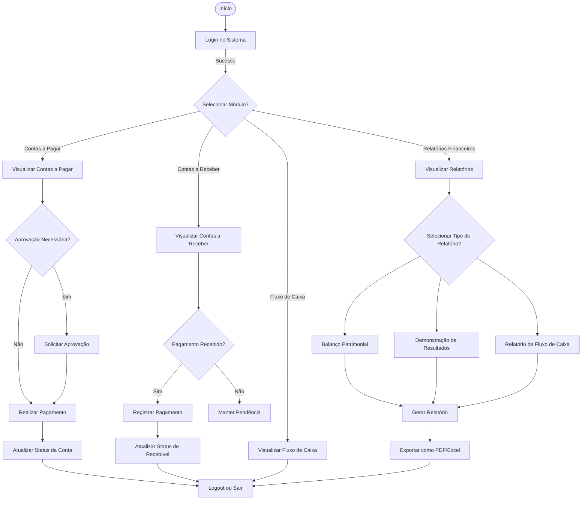

[Sumário Executivo](README.md) | [Diagrama de Atividades](README.DA.md) | [Levantamento e Análise de Requisitos](README.LAR.md) | [Detalhamento dos Requisitos](README.DR.md) | [Diagramas de sequência]() | [Modelo Conceitual](README.MC.md) | [Diagramas de Classes.](README.DC.md) 

# Diagrama de Atividades

