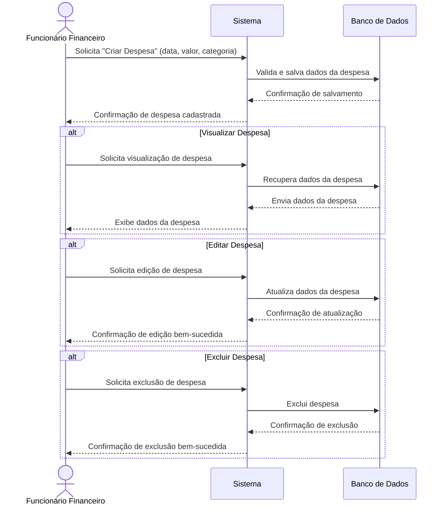
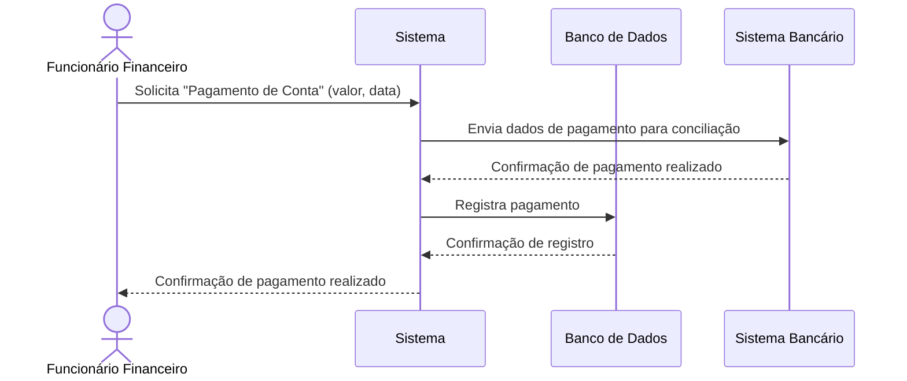
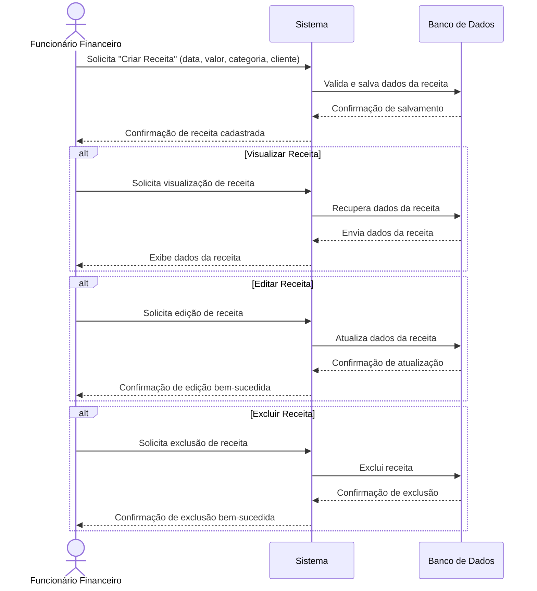
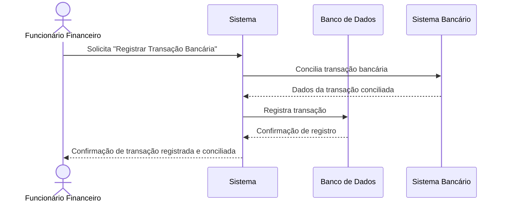
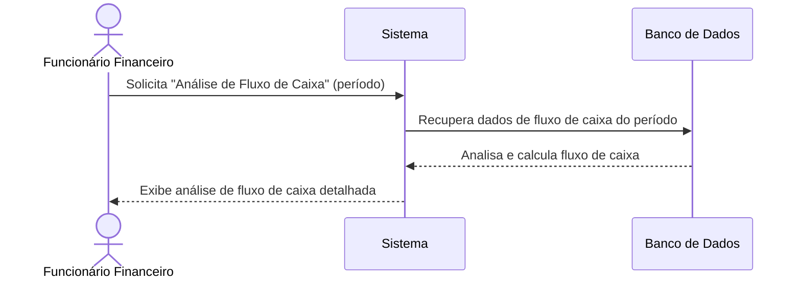
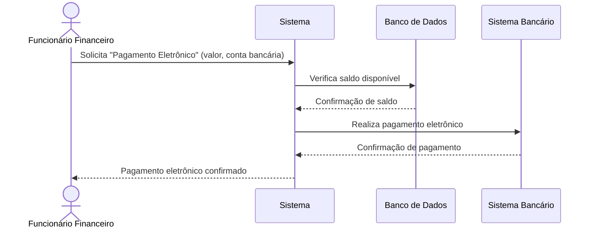

[Sumário Executivo](README.SE.md) | [Diagrama de Atividades](README.DA.md) | [Levantamento e Análise de Requisitos](README.LAR.md) | [Detalhamento dos Requisitos](README.DR.md) | [Diagramas de sequência](README.DS.md) | [Modelo Conceitual](README.MC.md) | [Diagramas de Classes.](README.DC.md) 

# Diagramas de Sequência

## Cadastro de Despesas (RF1)

## Pagamento de Contas (RF2)

## Cadastro de Receitas (RF3)

## Registro de Recebimentos e Pagamentos (RF4)

## Fluxo de Caixa (RF5)

## Pagamentos Eletronicos (RF6)

